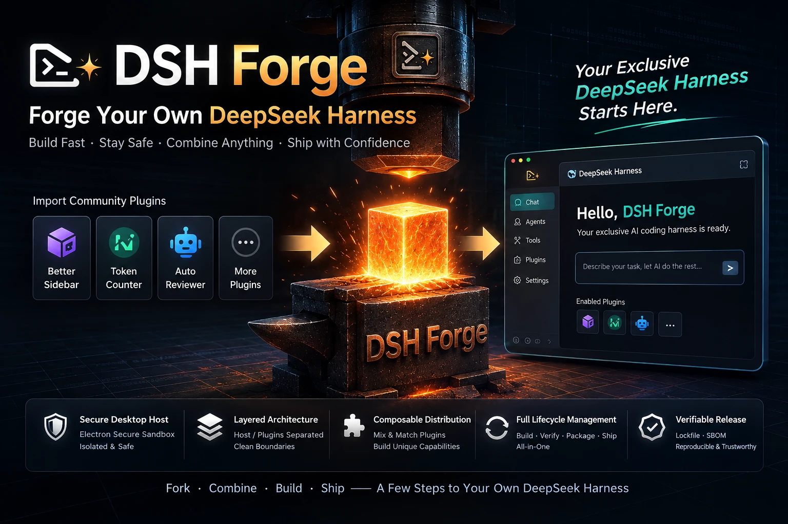

# ⚒️ DSH Forge

English | [中文](README.zh.md)

<p align="center">
  
</p>

<p align="center">
  <a href="https://ptonlix.github.io/dsh-forge/"></a>
  <a href="https://github.com/ptonlix/dsh-forge/pulls"></a>
  <a href="https://github.com/ptonlix/dsh-forge"></a>
</p>

<p align="center">
  <strong>DSH Forge</strong><br>
  Build a desktop distribution for your <strong>DeepSeek Harness</strong><br>
  <sub>Compose plugins at build time · Package an Electron app · Lock and verify dependencies</sub>
</p>

- **Install the official build** — this repository curates DSH plugins into an official desktop app for direct installation. See [official builds](https://github.com/ptonlix/dsh-forge/releases).
- **Fork and customize your Harness** — fork this repository to extend or replace DSH plugins, then package your own desktop app. DSH Forge handles the desktop-specific details.

## 🎨 DSH Forge Core Features

<p align="center">
  
</p>

### DSH Forge separates the Electron host from DSH plugins

1. `apps/desktop` is the only desktop host. It owns the launcher, window security, generation lifecycle, and platform adapters.
2. It creates the launcher capability, and the desktop layer registers the private `@dsh-forge/desktop-services-local` provider.
3. Third-party bundles depend only on the public [`@dsh-forge/desktop-services`](packages/desktop-services/README.md) contract. They use `desktopProfiles`, `desktopPnpm`, and `desktopServices` through Cordis without direct access to Electron, host paths, or pnpm arguments.

### Integrate community plugins quickly

- **Composable at build time**: `distribution.yml`, profiles, bundles, and the static catalog define the distribution.
- **Clear host boundary**: `apps/desktop` owns Electron and platform responsibilities; the public contract remains separate from the private provider, leaving DSH core unchanged.
- **Reproducible and verifiable**: the dependency closure is resolved and locked at build time, while lockfile, SBOM, and package checks become release evidence.

### Current desktop capabilities

- [x] **Electron host startup**: `apps/desktop` owns the single-instance lock, window creation, platform adapters, and controlled exit.
- [x] **Secure windows and navigation**: Chromium sandbox and context isolation are enabled, and Node integration is disabled. Only the current generation's loopback page is allowed; HTTP(S) and `mailto:` links open with the system, while arbitrary new windows and `file:` navigation are rejected.
- [x] **Profiles and DSH Home**: development can select a profile with `--profile`; packaged applications are bound to their build-time profile and place managed profiles in DSH Home.
- [x] **Generation lifecycle**: Host, loopback, window, and renderer must become ready in order before commit. The runtime supports `last-known-good` fallback, persisted failure facts, and managed-process teardown.
- [x] **Public desktop services**: `@dsh-forge/desktop-services` exposes `desktopProfiles`, `desktopPnpm`, and `desktopServices`; callers validate the protocol before use.
- [x] **Managed pnpm and installation recovery (low-level API)**: `inspect`, `reconcile`, `remove`, and catalog-confirmed installation use an operation lease, cancellation, WAL, source revalidation, and health checks. There is no page-based plugin installation entry point today.
- [x] **Full-package OTA**: version checks, Settings upgrade management, download progress, user confirmation, and restart receipts with failure recovery are supported for Windows, macOS, and Ubuntu AppImage. Linux OTA supports only writable AppImage on Ubuntu 22.04+.
- [ ] **Runtime profile switching in packaged applications**: each released package remains bound to a single build-time profile; the UI does not provide switching.
- [ ] **A page-based plugin marketplace and online download/installation**.
- [ ] **Storage management**.
- [ ] **Tray or terminal UI**.

## 🚀 Quick Start

### Requirements

- Node.js `>=22.13.0`
- pnpm `11.7.0`
- macOS, Windows, or Linux that can run Electron

Install dependencies and start the default development profile:

```sh
pnpm install --frozen-lockfile
pnpm dev
```

Switch to another development profile with `pnpm dev -- --profile developer`.

### Use the Plugin-Import Skill

Install `dsh-forge-add-plugin` from the root of your DSH Forge fork:

```sh
npx skills add ptonlix/dsh-forge --skill dsh-forge-add-plugin
```

The CLI asks you to choose the agent you use and a project-level installation method. Then tell the agent the npm package or GitHub URL to add, with an optional target profile:

```text
Use $dsh-forge-add-plugin to add dsh-better-sidebar@0.14.0 to developer.
Use $dsh-forge-add-plugin to add https://github.com/example/dsh-plugin to developer.
```

When omitted, the target defaults to `dsh-forge-official`. GitHub repositories must be pinned to a commit, and the current `dsh-forge-official` profile accepts published npm bundles only; use `developer` for a GitHub-only plugin.
The skill audits sources and scripts, updates OpenSpec, dependencies, catalog, and profile, then runs a real Electron package and smoke test. It asks for confirmation before third-party lifecycle scripts are allowed to run.

## 🛠️ Common Commands

| Command | Purpose |
| --- | --- |
| `pnpm run profile:resolve -- dsh-forge-official` | Resolve the profile into lockfile and SBOM inputs |
| `pnpm run profile:verify -- dsh-forge-official` | Verify the composition against runtime and schema constraints |
| `pnpm run package:desktop -- dsh-forge-official` | Build the Electron package for the profile |
| `pnpm run package:inspect -- dsh-forge-official` | Inspect package contents and runtime facts |
| `pnpm run package:smoke -- dsh-forge-official` | Boot the packaged app and run smoke checks |

Quality and documentation gates:

```sh
pnpm run check:all
pnpm run docs:check
pnpm run docs:build
```

## 🗂️ Repository Layout

```text
.
├── .agents/
│   └── skills/                 # Agent workflows and maintenance rules in this repository
├── .github/
│   └── workflows/              # CI, release, and site automation
├── apps/
│   └── desktop/                # Electron host
│       ├── bootstrap/          # Startup and single-instance entry point
│       ├── platform/           # Window, security, and native-platform adapters
│       └── runtime/            # Generation and runtime orchestration
├── assets/                     # Graphic assets for the README and site
├── build/                      # Package icons, licenses, and macOS entitlements
├── catalog/
│   └── catalog.yml             # Static review facts for external bundles
├── docs/
│   ├── design/                 # Architecture and distribution boundaries
│   ├── engineering/            # Engineering, migration, and verification records
│   ├── i18n/                   # Public-document manifest and bilingual governance
│   └── reference/              # Configuration, service, and operational references
├── openspec/
│   ├── changes/                # Active and archived change materials
│   └── specs/                  # Current capability specifications
├── packages/
│   ├── bundles/
│   │   └── desktop-layer/      # Desktop bundle temporarily injected by the launcher
│   ├── desktop-services/       # Public contract for bundles and forks
│   └── desktop-services-local/ # Private provider: WAL and managed pnpm
├── profiles/
│   ├── developer/              # Minimal development composition
│   └── dsh-forge-official/     # Default distribution composition
├── schemas/                    # Contracts for distribution, profile, bundle, and catalog
├── scripts/                    # Build, package, boundary, smoke, and release orchestration
├── skills/
│   └── dsh-forge-add-plugin/   # Distributable skill discovered by `npx skills`
├── tests/
│   └── fixtures/               # Unit, integration, boundary, and release-test fixtures
├── tools/
│   └── profile-toolchain/      # Resolve, verify, catalog, SBOM, and CLI tooling
├── website/
│   ├── .vitepress/             # VitePress configuration
│   └── docs.ts                 # Document projection and site navigation
├── distribution.yml            # Distribution identity, default profile, and platform declarations
├── package.json                # Workspace dependencies, commands, and build entry points
└── pnpm-workspace.yaml         # Workspace scope and allowed build scripts
```

## 📚 Documentation

The public documentation map is [`docs/README.md`](docs/README.md). The architecture is owned by
[`docs/design/dsh-forge.md`](docs/design/dsh-forge.md), while stable configuration and service facts
belong to [`docs/reference/foundation-contracts.md`](docs/reference/foundation-contracts.md), and source,
derived-output, and recovery boundaries belong to
[`docs/engineering/foundation-boundaries.md`](docs/engineering/foundation-boundaries.md). The profile
compiler is documented in
[`tools/profile-toolchain/README.md`](tools/profile-toolchain/README.md).

Every public page consists of an English `foo.md`, a Chinese `foo.zh.md`, and a `foo.i18n.yaml` hash record.
See [`docs/i18n/README.md`](docs/i18n/README.md) for bilingual governance.

## ⭐ Star History

<p align="center">
  <a href="https://github.com/ptonlix/dsh-forge/stargazers">
    <picture>
      <source media="(prefers-color-scheme: dark)" srcset="https://raw.githubusercontent.com/ptonlix/dsh-forge/star-history/assets/star-history-dark.svg">
      
    </picture>
  </a>
</p>
