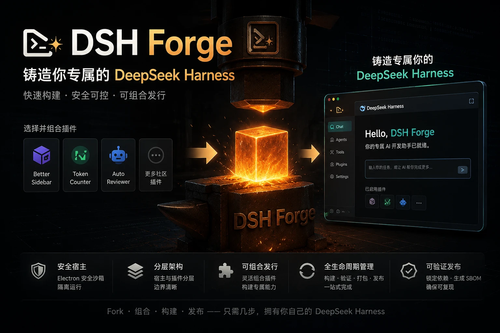
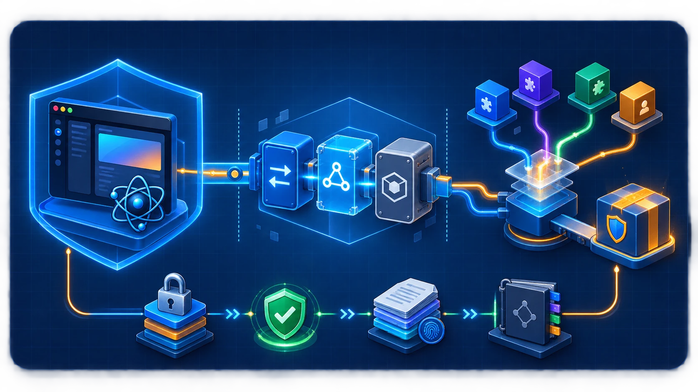

# ⚒️ DSH Forge

中文 | [English](README.md)

<p align="center">
  
</p>

<p align="center">
  <a href="https://ptonlix.github.io/dsh-forge/"></a>
  <a href="https://github.com/ptonlix/dsh-forge/pulls"></a>
  <a href="https://github.com/ptonlix/dsh-forge"></a>
</p>

<p align="center">
  <strong>DSH Forge 铸造台</strong><br>
  为你的 <strong>DeepSeek Harness</strong> 构建桌面发行版<br>
  <sub>构建期组合插件 · 打包 Electron 应用 · 锁定并验证依赖</sub>
</p>

- **直接安装官方版本** 本仓库会精选当前DSH插件整合成一个官方桌面端（懒人一键下载安装）[官方构建](https://github.com/ptonlix/dsh-forge/releases)
- **Fork 并定制自己的 Harness** —— Fork 本仓库， 基于本仓库的内容拓展或者替换相关DSH插件，打包定制属于自己的桌面端 （DSH Forge已为你处理好桌面端的细节）


## 🎨 DSH Forge 核心特色

<p align="center">
  
</p>

### DSH Forge 将 Electron 宿主与 DSH 插件分层
1. `apps/desktop` 是唯一的桌面宿主，负责启动器、窗口安全、generation 生命周期和平台适配；
2. 创建 launcher capability，由 desktop layer 注册私有 `@dsh-forge/desktop-services-local` provider。
3. 第三方 bundle 只依赖公开的[`@dsh-forge/desktop-services`](packages/desktop-services/README.zh.md) contract，通过 Cordis 使用 `desktopProfiles`、`desktopPnpm` 和 `desktopServices`，不直接接触 Electron、宿主路径或 pnpm参数。

### 支持快速继承社区插件：

- **构建期可组合**：`distribution.yml`、profile、bundle 和静态 catalog 共同定义发行版
- **宿主边界清晰**：`apps/desktop` 聚焦 Electron 和平台职责，公开 contract 与私有 provider 分离，DSH 核心无需改写。
- **可复现、可验证**：依赖闭包在构建期解析并锁定，lockfile、SBOM 和打包检查沉淀为发布证据

### 当前已支持的桌面端功能

- [x] **Electron 宿主启动**：`apps/desktop` 负责单实例锁、窗口创建、平台适配和受控退出。
- [x] **安全窗口与导航**：启用 Chromium sandbox、context isolation，关闭 Node integration；仅允许当前
  generation 的 loopback 页面，HTTP(S) 和 `mailto:` 外链交给系统，任意新窗口和 `file:` 导航都会被拒绝。
- [x] **Profile 与 DSH Home**：开发态可以使用 `--profile` 选择 profile；打包应用固定构建时的 profile，并将
  受管 profile 放入 DSH Home。
- [x] **Generation 生命周期**：Host、loopback、窗口和 renderer 按序就绪后才提交；支持
  `last-known-good` 回退、失败事实持久化和受管进程 teardown。
- [x] **公开桌面 service**：通过 `@dsh-forge/desktop-services` 提供 `desktopProfiles`、`desktopPnpm` 和
  `desktopServices`，调用前校验 protocol。
- [x] **受管 pnpm 与安装恢复（底层 API）**：支持 `inspect`、`reconcile`、`remove` 和 catalog 确认安装，
  带 operation lease、取消、WAL、来源复核和健康检查；当前没有页面端插件安装入口。
- [x] **完整安装包 OTA**：支持版本检查、设置页“升级管理”、下载进度、用户确认、Windows/macOS/Ubuntu
  AppImage 重启回执与失败恢复；Linux OTA 仅支持 Ubuntu 22.04+ 的可写 AppImage。
- [ ] **打包应用运行时 profile 切换**：当前发行包固定一个 profile，页面端不提供切换。
- [ ] **页面端插件市场与在线下载/安装**。
- [ ] **存储空间管理**。
- [ ] **托盘或终端 UI**。


## 🚀 快速开始

### 环境要求

- Node.js `>=22.13.0`
- pnpm `11.7.0`
- 能运行 Electron 的 macOS、Windows 或 Linux 环境

安装依赖并启动默认开发 profile：

```sh
pnpm install --frozen-lockfile
pnpm dev
```

切换其他开发 profile：`pnpm dev -- --profile developer`

### 使用插件引入 Skill

在你的 DSH Forge Fork 根目录安装 `dsh-forge-add-plugin`：

```sh
npx skills add ptonlix/dsh-forge --skill dsh-forge-add-plugin
```

CLI 会提示你选择已使用的 agent 与项目级安装方式。随后直接告诉 agent 要引入的 npm 包或
GitHub 地址，以及可选目标 profile：

```text
使用 $dsh-forge-add-plugin 将 dsh-better-sidebar@0.14.0 引入 developer。
使用 $dsh-forge-add-plugin 将 https://github.com/example/dsh-plugin 引入 developer。
```

省略目标时默认引入 `dsh-forge-official`。GitHub 仓库必须固定到 commit，且当前`dsh-forge-official` profile 只接受已发布的 npm bundle；仅存在 GitHub 来源的插件请指定 `developer`。
skill 会审核来源和脚本、更新 OpenSpec、依赖、catalog 与 profile，并执行实际 Electron 打包和
smoke；需要执行第三方生命周期脚本时会先请求确认。

## 🛠️ 常用命令

| 命令 | 作用 |
| --- | --- |
| `pnpm run profile:resolve -- dsh-forge-official` | 把 profile 解析为 lockfile 和 SBOM 输入 |
| `pnpm run profile:verify -- dsh-forge-official` | 对照运行时和 schema 约束验证组合 |
| `pnpm run package:desktop -- dsh-forge-official` | 为 profile 构建 Electron 安装包 |
| `pnpm run package:inspect -- dsh-forge-official` | 检查安装包内容和运行时事实 |
| `pnpm run package:smoke -- dsh-forge-official` | 启动打包应用并运行 smoke 检查 |

质量与文档门禁：

```sh
pnpm run check:all
pnpm run docs:check
pnpm run docs:build
```

## 🗂️ 仓库布局

```text
.
├── .agents/
│   └── skills/                 # 仓库内 agent 工作流与维护规范
├── .github/
│   └── workflows/              # CI、发布与站点自动化
├── apps/
│   └── desktop/                # Electron 宿主
│       ├── bootstrap/          # 启动与单实例入口
│       ├── platform/           # 窗口、安全与原生平台适配
│       └── runtime/            # generation 与运行时编排
├── assets/                     # README 与站点使用的图形资源
├── build/                      # 安装包图标、许可与 macOS entitlements
├── catalog/
│   └── catalog.yml             # 外部 bundle 的静态审核事实
├── docs/
│   ├── design/                 # 架构与发行版边界
│   ├── engineering/            # 工程、迁移与验证记录
│   ├── i18n/                   # 公开文档清单与双语治理
│   └── reference/              # 配置、service 与操作参考
├── openspec/
│   ├── changes/                # 活动及归档变更材料
│   └── specs/                  # 当前能力规范
├── packages/
│   ├── bundles/
│   │   └── desktop-layer/      # launcher 临时注入的桌面 bundle
│   ├── desktop-services/       # 面向 bundle/Fork 的公开 contract
│   └── desktop-services-local/ # 私有 provider：WAL、受管 pnpm
├── profiles/
│   ├── developer/              # 最小开发组合
│   └── dsh-forge-official/     # 默认发行组合
├── schemas/                    # distribution、profile、bundle 与 catalog 契约
├── scripts/                    # 构建、打包、边界、smoke 与发布编排
├── skills/
│   └── dsh-forge-add-plugin/   # 供 `npx skills` 发现的可分发 skill
├── tests/
│   └── fixtures/               # 单元、集成、边界与发布测试夹具
├── tools/
│   └── profile-toolchain/      # resolve、verify、catalog、SBOM 与 CLI
├── website/
│   ├── .vitepress/             # VitePress 配置
│   └── docs.ts                 # 文档投影与站点导航
├── distribution.yml            # 发行版身份、默认 profile 与平台声明
├── package.json                # workspace 依赖、命令与构建入口
└── pnpm-workspace.yaml         # workspace 范围与允许的构建脚本
```

## 📚 文档导航

公开文档地图见 [`docs/README.zh.md`](docs/README.zh.md)。架构归属
[`docs/design/dsh-forge.zh.md`](docs/design/dsh-forge.zh.md)，稳定配置和 service 事实
归属 [`docs/reference/foundation-contracts.zh.md`](docs/reference/foundation-contracts.zh.md)，
源/产物与恢复边界归属
[`docs/engineering/foundation-boundaries.zh.md`](docs/engineering/foundation-boundaries.zh.md)。
profile 编译器见
[`tools/profile-toolchain/README.zh.md`](tools/profile-toolchain/README.zh.md)。

每篇公开页面都由英文 `foo.md`、中文 `foo.zh.md` 和 `foo.i18n.yaml` hash 记录组成。
双语治理规则见 [`docs/i18n/README.md`](docs/i18n/README.md)。

## ⭐ Star 历史

<p align="center">
  <a href="https://github.com/ptonlix/dsh-forge/stargazers">
    <picture>
      <source media="(prefers-color-scheme: dark)" srcset="https://raw.githubusercontent.com/ptonlix/dsh-forge/star-history/assets/star-history-dark.svg">
      
    </picture>
  </a>
</p>
